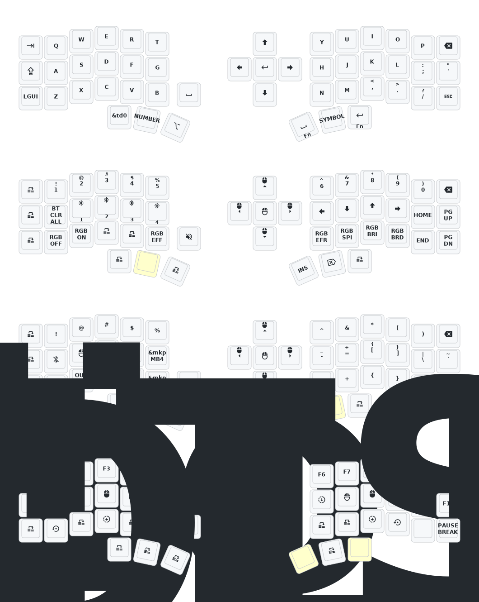

- [English](README_EN.md)
- [Japanese](README-jp.md)

# Corne ZMK Firmware for Eyelash Peripherals
## キーの入れ替え

- Q1. ビルドするためにpacmanで何かインストールするんですか？
- A1. はい、[ZMKのドキュメント](https://zmk.dev/docs/getting-started/installation#installing-on-macos)に従ってください。Homebrewを使っている場合は、`brew install cmake ninja west dfu-util`を実行してください。
ZMK（eyelash_corne）をビルドするには、いくつかの開発ツールを pacman（Manjaro / Arch Linux）でインストールしておく必要があります。

以下に、Manjaro/Arch 環境での完全セットアップ手順を整理しました。
一度入れてしまえば、今後どのキーボードでも ZMK ファームをビルドできます。

### 1. 必須パッケージのインストール

```
% sudo pacman -S --needed git cmake ninja python-pip west dtc wget unzip
```

#### 説明
- git: リポジトリの取得（ZMK, Eyelash Corneなど）
- cmake + ninja: Zephyr のビルドシステム
- python-pip: Pythonモジュール導入に必要
- west: Zephyr公式ビルドツール
- dtc: デバイスツリーコンパイラ（.dts/.dtsiファイルを解釈）
- wget, unzip: SDKダウンロード用

### 2. Zephyr SDK のインストール

ZMK は Zephyr RTOS をベースにしているため、Zephyr SDK を導入します。

#### 作業用ディレクトリに移動
```
% cd ~
```

#### 最新のSDKを取得（例: v0.16.5）

```
wget https://github.com/zephyrproject-rtos/sdk-ng/releases/download/v0.16.5/zephyr-sdk-0.16.5_linux-x86_64.tar.xz
```

# 展開
```
tar xf zephyr-sdk-0.16.5_linux-x86_64.tar.xz
sudo mv zephyr-sdk-0.16.5 /opt/
```

# セットアップスクリプト実行
```
cd /opt/zephyr-sdk-0.16.5
sudo ./setup.sh
```

    SDKは /opt/zephyr-sdk-0.16.5 に配置するのが一般的です。

✅ 3. Zephyr 環境変数を設定

~/.bashrc または ~/.zshrc に次を追加：

```
export ZEPHYR_TOOLCHAIN_VARIANT=zephyr
export ZEPHYR_SDK_INSTALL_DIR=/opt/zephyr-sdk-0.16.5
```

設定を反映：

```
source ~/.bashrc
# または
source ~/.zshrc
```

✅ 4. ZMK の west 環境セットアップ

すでに zmk-new_corne を clone 済みだと思いますが、念のため：

```
git clone https://github.com/yamagen/zmk-new_corne.git
cd zmk-new_corne
west init -l config
west update
```

    これで zmk のソース（Zephyr とボード定義など）が自動的に取得されます。

✅ 5. ビルド

左側（例）：

```
west build -p -b eyelash_corne -d build/left -- -DSHIELD=corne_left
```

右側（例）：

```
west build -p -b eyelash_corne -d build/right -- -DSHIELD=corne_right
```

成功すれば：

```
-- west build: generating build system
-- west build: building application
[100%] Built target zephyr/zephyr.elf
```

という表示になり、
build/left/zephyr/zmk.uf2 などが生成されます。

✅ 6. 書き込み

生成された .uf2 ファイルを、Corne の左右それぞれのドライブにドラッグ＆ドロップ。
（USB接続時に NICENANO などのドライブが見えるはずです）
💡オプション（あると便利）

```
sudo pacman -S dfu-util
```
- DFU書き込みや nRF52840 の場合に必要なことがあります。

## 動作確認後の流れ

> build フォルダは再ビルドで上書き可能
> west build -p で前回のビルドキャッシュをクリア
> 設定ファイルだけ変更した場合は -p を省いてもOK

もし、途中で

```
    command not found: west
```
    などが出た場合は、pipでインストールできます：

```
pip install --user west
```
なかなか慣れないのはこのキーの並びのせいかもしれません。
---

[jp]# (Eyelash Peripherals) Corne ZMK リポジトリ

[jp] **このキーボードは [foostanのCorne](https://github.com/foostan/crkbd) とは異なります。標準の `corne` ファームウェアでは動作しません。**

[jp] 

[jp] このキーボードの3Dモデルが必要な場合は、`...`.

[jp] ## 使い方

1. [このリポジトリをフォークする](https://docs.github.com/ja/get-started/quickstart/fork-a-repo#forking-a-repository)。
2. [**Actions** タブをクリックして、ワークフローが有効になっていることを確認します](https://docs.github.com/ja/actions/managing-workflow-runs-and-deployments/managing-workflow-runs/disabling-and-enabling-a-workflow#enabling-a-workflow)。
3. [`config/west.yml`](config/west.yml) の `eyelash_corne` プロジェクトがまだ動作することを確認してください。`boards/arm/eyelash_corne` フォルダはこのURLからダウンロードされます。
4. フォークにまだ `boards/arm/eyelash_corne` フォルダがある場合は、削除してください。
```
rm -rf boards/arm/eyelash_corne
```

**すでにZMKの設定リポジトリをお持ちの場合は、[フォークする代わりにモジュールとして追加することもできます](https://zmk.dev/docs/features/modules#building-with-modules)。**

## キーマップ図


